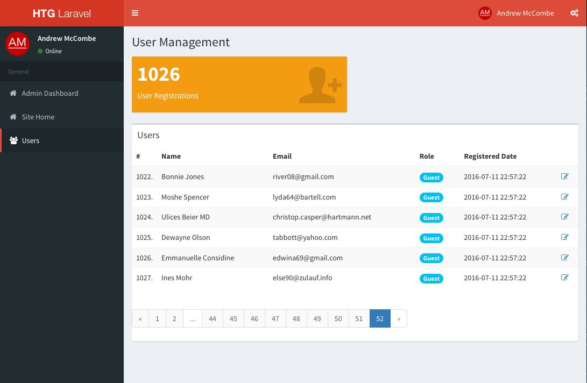

## HTG Laravel

A basic Laravel project aimed at facilitating rapid prototyping. Why write yet
another login form when you just want to try something out?

This project has:

* User Registration and Authentication
* Admin area with user management.
* Admin area using the excellent AdminLTE theme from Abdullah Almaseed (https://almsaeedstudio.com/)

# Requirements

* PHP 5.6+ (recommended PHP7+)
* MySQL 5.6
* Apache or Nginx web server
* composer installed

# Installation
1. Clone the repository to a local folder
2. Install the dependencies with composer: `composer install`
3. Copy the `.env.example` file to `.env`.  `cp .env.example .env`
4. Set up a MySQL Schema and add the credentials to `.env`.
5. Create a security key: `php artisan key:generate`
6. Run the migrations to install the database tables: `php artisan migrate`
7. Run the database seeds: `php artisan db:seed`
8. Start the web server `php artisan serve` should be enough to get you up and running.
9. Finally, browse to http://localhost:8000, and go make something awesome.

